# GC Mayor Workflow Pack

This pack provides a convoy-first planning and implementation workflow for Gas
City work:

- `gc.mayor` is the user-facing coordinator skill. It gathers requirements,
  writes implementation plans, creates approved beads/convoys, and discovers
  runnable workflow formulas.
- Formula workflows opt into discovery with `[catalog]` metadata. The mayor
  discovers them with `gc formula catalog --json`, inspects them with
  `gc formula show <name> --json`, and launches them with `gc sling`.
- Cataloged formulas cover implementation, build loops, targetless reports, and
  GitHub adapter workflows. Helper/base formulas remain out of the catalog.

Import it with the `gc` binding:

```toml
[imports.gc]
source = "../gascity-packs/gascity"
```

Run the mayor skill to plan and coordinate work:

```text
Use skill gc.mayor
```

Discover formula workflows from the active rig/city context:

```sh
gc formula catalog --json
gc formula show implement --json
```

Then launch implementation against an approved implementation convoy:

```sh
gc sling gc.run-operator <convoy-id> --on implement \
  --var context_path=<optional-context-yaml> \
  --var drain_policy=separate
```

If part of the factory already ran, launch the targetless continuation
entrypoint that matches the artifacts you already have:

```sh
gc sling gc.run-operator build-from-decompose --formula \
  --var artifact_root=<artifact-dir> \
  --var requirements_path=<artifact-dir>/requirements.md \
  --var plan_path=<artifact-dir>/implementation-plan.md \
  --var plan_review_path=<artifact-dir>/plan-review.md \
  --var drain_policy=separate
```

Use `build-from-plan` when requirements already exist, `build-from-decompose`
when approved requirements/plan/plan-review already exist, `build-from-convoy`
when an implementation convoy already exists, and `build-from-review` when
implementation evidence already exists. Use `implement` when you want the
lower-level direct implementation-convoy launcher without the build review and
publish suffix.

Every formula in this pack uses `contract = "graph.v2"`. Targeted formulas take
the core-injected reserved convoy target; they do not declare `issue`,
`bead_id`, or `convoy_id` variables. `drain_policy=separate` is the standalone
default. Use `same-session` only when preserving one shared worktree and
conversation is explicitly desired and core shared drain support is available.

The pack ships providerless rig role agents under `gascity/roles`. Standalone use
requires both imports: the top-level `gc` import for formulas and the mayor
skill, plus a `gascity/roles` import on each target rig that should run work. A city
that imports only the formulas can read the mayor skill, but default formula
steps will not have rig-local `gc.*` role agents to route to.

Import the roles pack for each target rig so work runs in the target
repository. By default the agents inherit the city/workspace provider; advanced
users can patch individual roles to a specific provider without overriding
formulas:

```toml
[[rigs]]
name = "my-repo"

[rigs.imports.gc]
source = "/path/to/gascity/roles"

[[rigs.patches]]
agent = "gc.implementation-worker"
provider = "your-provider"
```

Launch the formulas from the target rig context, or pass your normal
`--rig <target-rig>` selection so `gc.run-operator` resolves to the rig-local
role from `gascity/roles`.

Default formula routes use these qualified targets: `gc.run-operator`,
`gc.requirements-planner`, `gc.design-author`, `gc.task-decomposer`,
`gc.issue-triager`, `gc.design-implementation-reviewer`,
`gc.design-test-risk-reviewer`, `gc.review-synthesizer`,
`gc.implementation-worker`, `gc.gap-analyst`, `gc.implementation-reviewer`,
and `gc.publisher`.

## Build Methodology Contract

`build-base` is the virtual full-lifecycle workflow contract. It defines the
stable stage sequence that concrete build methodology packs can override:

```text
prepare -> requirements -> plan -> plan-review -> decompose ->
implement | implement-same-session -> review -> finalize -> publish
```

`build-base` is internal and should not be launched directly. Use
`build-basic` for the default Gas City implementation. It maps the base stages
onto the existing Gas City requirements, implementation-plan, design-review,
create-beads, implementation, post-implementation review, and publish helpers.
Gap-analysis is a review lens inside the post-implementation review loop, so
coverage findings are synthesized and fixed with the rest of the review output.

Continuation bases are nested suffixes. Each base validates its prerequisite
inputs, performs one stage or handoff, and delegates to the next suffix:

```text
build-from-requirements-base
  -> build-from-plan-base
  -> build-from-decompose-base
  -> build-from-convoy-base
  -> build-from-review-base
```

The cataloged `build-from-*` formulas are thin default Gas City wrappers around
those bases. Methodology packs that want the same entrypoints should extend the
matching `build-from-*-base` formula and override selector defaults, routes,
drain item formulas, or review expansions instead of copying the suffix graph.

Third-party methodology packs can extend `build-base` and override only the
stages they need. For implementation, packs should keep the Gas City drain
lifecycle and point the two static drain steps at pack-specific item formulas
that extend `do-work` and `do-work-item`. The repository currently ships
concrete vendored implementations for Compound Engineering, Superpowers, BMAD
Method, and garrytan/gstack. Those packs import this pack as `gc` internally,
so users can import one methodology pack at city scope while keeping the
existing `gc.*` role override surface for rig agents.

Third-party packs should treat upstream agent definitions, prompts, and skills
as vendored methodology inputs, not as runtime authority. When an upstream
methodology says to spawn subagents, dispatch a task tool, or run a plugin
command, the pack should convert that shape into a Gas City formula or expansion
with explicit `gc.*` lanes. The model may read the upstream persona or prompt
file for behavior, but work routing, retries, persistence, and fanout/fanin must
remain in the Gas City graph.

Raw-framework subagents become Gas City fanouts. That is the core rule for
methodology packs: preserve the user-visible process, reviewer perspective, and
handoff order, but make the routing durable through beads, drains, formulas, and
expansion children. Structured step-file prompts are usually good candidates for
separate formulas or expansion loops because Gas City can then retry, observe,
and resume each step independently.

Use two mode concepts when designing or launching methodology formulas:

- `interaction_mode` controls human participation in planning and gates.
  `interactive` preserves blocking questions and approval menus, `autonomous`
  lets the workflow make reasonable decisions while recording evidence, and
  `headless` is for automation with no blocking prompts.
- `review_mode` controls review authority. `report` is read-only output for
  adapters such as GitHub PR comments, `agent` is a structured machine handoff
  whose caller applies fixes, and `interactive` preserves a raw top-level review
  experience that may apply safe fixes when the methodology allows it.

The current cross-framework audit and follow-up proposal lives in
[`docs/design/build-methodology-framework-audit.md`](../docs/design/build-methodology-framework-audit.md).

## Requirements Ledgers

This base pack keeps product requirements beside the formula implementation:

- `REQUIREMENTS.md` defines the build methodology base contract and the default
  `build-basic` implementation expectations.
- `formulas/REQUIREMENTS.md` contains one durable behavior row for every base
  pack formula.

When a base formula's stage order, selector variables, drain behavior, artifact
contract, fanout/fanin, review loop, adapter side effect, or catalog surface
changes, update the matching requirements row in the same change. The formula
asset tests fail if a formula exists without a requirements row.

## Build Flow

`build-base` is the virtual contract. `build-basic` is the concrete Gas City
implementation that demonstrates the override surface without vendoring a
third-party methodology.

```mermaid
flowchart TD
    classDef base fill:#eef2ff,stroke:#4f46e5,color:#111827;
    classDef basic fill:#ecfdf5,stroke:#059669,color:#111827;
    classDef infra fill:#fff7ed,stroke:#d97706,color:#111827;
    classDef terminal fill:#f9fafb,stroke:#6b7280,color:#111827;

    Start["Launch build-basic<br/>or child of build-base"]:::terminal --> Prepare["prepare<br/>build-base contract"]:::base
    Prepare --> Requirements["requirements<br/>build-basic override<br/>gc.requirements-planner"]:::basic
    Requirements --> Plan["plan<br/>build-basic override<br/>gc.design-author"]:::basic
    Plan --> PlanReview["plan-review<br/>build-basic design review"]:::basic
    PlanReview --> PlanGate{"plan approved?<br/>design-review contract"}:::infra
    PlanGate -->|no: revise plan/review artifact| Plan
    PlanGate -->|yes| Decompose["decompose<br/>build-basic task beads"]:::basic
    Decompose --> Convoy["implementation convoy<br/>bead dependency graph"]:::infra
    Convoy --> DrainChoice{"drain policy<br/>Gas City drain"}:::infra
    DrainChoice -->|separate| DrainSeparate["separate drain<br/>parallel by convoy deps"]:::infra
    DrainChoice -->|same-session| DrainShared["same-session drain<br/>single worker lane"]:::infra

    subgraph ItemFormula["do-work item formulas: one formula instance per implementation bead"]
        direction TB
        SeparatePrep["prepare-worktree<br/>do-work"]:::base --> Implement["implement owned work<br/>gc.implementation-worker"]:::basic
        SharedImplement["implement shared item<br/>do-work-item"]:::base
        Implement --> CloseItem["close source anchor<br/>do-work"]:::base
    end

    DrainSeparate --> SeparatePrep
    DrainShared --> SharedImplement
    CloseItem --> DrainFanIn["fan in<br/>drain waits for all item roots"]:::infra
    SharedImplement --> DrainFanIn

    DrainFanIn --> Review["review<br/>build-basic implementation review"]:::basic

    subgraph ReviewLoop["post-implementation review loop: build-basic single-lane default"]
        direction TB
        Review --> ReviewLens["implementation review<br/>single reviewer lane"]:::basic
        ReviewLens --> ReviewReport["synthesize findings and required fixes"]:::basic
        ReviewReport --> ApplyFixes["apply required fixes when needed"]:::basic
        ApplyFixes --> ReviewGate{"implementation approved?<br/>review contract"}:::infra
        ReviewGate -->|no: fix and re-review| ReviewLens
        ReviewGate -->|yes| ReviewDone["review approved"]:::basic
    end

    ReviewDone --> Finalize["finalize<br/>build-basic summary"]:::basic
    Finalize --> Publish["publish<br/>build-basic or build-base no-op/push/PR"]:::basic
    Publish --> Done["workflow complete"]:::terminal
```



Blue nodes are the base contract or inherited item lifecycle, green nodes are
the concrete `build-basic` implementation, and amber nodes are Gas City graph,
convoy, or drain infrastructure. Concrete methodology packs extend the same
shape: they can override requirements, planning, review fanout, item formulas,
or finalization while preserving the convoy/drain/fan-in mechanics. The
`build-basic` review step is intentionally single-lane; packs such as
Superpowers, Compound Engineering, and BMAD replace it with expansion formulas
whose reviewer beads fan out before synthesis.

## Stable Workflow Override Interface

This section is the external compatibility promise for this pack's workflow
customization surface. The pack exposes two stable customization modes:

1. **Basic asset shadowing.** Put a Markdown file at the same relative path in a
   higher-priority city or local pack layer. Formula step bodies live at
   `assets/workflows/<formula>/<step-id>.md`. Gas City resolves these
   `description_file` assets through the normal import/layer search path, so the
   shadowing file replaces the base prompt text without changing the formula
   graph.
2. **Advanced step override.** Copy the formula into a higher-priority formula
   layer and replace the documented step block. Preserve the formula name, vars,
   metadata keys, dependency edges, and sink contracts that downstream steps
   still depend on. Use this when you need to replace one step with another
   formula, an expansion, a wider fanout, a retry loop, or a different agent
   route.

Only the override points below are intended as stable public interfaces. Other
steps may be useful to inspect, but they are implementation details unless they
are listed here.

When overriding a step that writes a downstream artifact, keep the artifact
contract stable:

- Verdict reports must use `schema: gc.verdict-report.v1` with
  `verdict: pass|fail`.
- GitHub issue triage reports must use `schema:
  gc.github-issue-triage-report.v1`.
- GitHub adapter workflows must preserve the documented `gc.github.*` metadata
  on the workflow root bead.
- Build and implementation workflows must not close the input convoy head unless
  the base step explicitly does so.
- Steps that only validate context must not mutate source files.

### GitHub Issue Triage

Use this when you want project-specific triage instructions for issue labels,
severity, evidence requirements, or public comment style.

Stable basic override:
`assets/workflows/github-issue-triage-base/write-triage-report.md`

Stable advanced step:
`github-issue-triage-base` step `write-triage-report`

Basic example: local label and severity policy.

Create `assets/workflows/github-issue-triage-base/write-triage-report.md` in
your city assets:

```markdown
Apply the repository triage policy before writing `triage-report.md`.

- If the issue touches `internal/api/`, `docs/schema/openapi.*`, or generated
  dashboard client types, read `engdocs/architecture/api-control-plane.md` and
  `engdocs/contributors/huma-usage.md` before assigning priority.
- Mark `needs_info` when the report lacks a reproduction, failing test, stack
  trace, linked CI artifact, or exact version. Do not invent a reproduction.
- Use priority `p1` only when current `origin/main` is affected or data loss is
  plausible. Use `p2` for historical release-only regressions unless security
  or data integrity is involved.
- Include suggested GitHub labels in the human-readable body, but keep the YAML
  front matter limited to the schema accepted by the validator.
```

Advanced example: replace triage with a two-lane evidence pass and synthesis.

Copy `github-issue-triage-base.formula.toml` into your local formula layer and
replace only `write-triage-report`:

```toml
[[steps]]
id = "write-triage-report"
title = "Run product and engineering triage"
needs = ["reuse-current-body-hash"]
expand = "company-github-issue-triage-quorum"
metadata = { "gc.run_target" = "gc.review-synthesizer" }
```

The expansion should read the same `gc.github.snapshot_path` and write the same
`triage-report.md` under `gc.github.triage_dir`. It may run separate product and
engineering lanes, but its sink must still validate as
`gc.github-issue-triage-report.v1` so `render-comment`, human gating, and
`post-comment` continue to work.

### Requirements Planning

Use this when issue-fix requirements need local acceptance criteria, release
policy, customer-impact language, or compatibility constraints.

Stable basic override:
`assets/workflows/github-issue-fix-base/generate-requirements.md`

Stable advanced step:
`github-issue-fix-base` step `generate-requirements`

Basic example: require W6H and example-mapping coverage.

Create `assets/workflows/github-issue-fix-base/generate-requirements.md`:

```markdown
Generate requirements using the local planning standard.

- Include Who, What, When, Where, Why, and How sections.
- Add an Example Mapping section with at least one happy path, one negative
  path, and one edge case tied to the GitHub issue evidence.
- Call out compatibility constraints for existing CLI flags, persisted bead
  metadata, and public GitHub comments.
- Do not approve implementation until every acceptance criterion can be tested
  by a unit, integration, or explicit manual verification step.
```

Advanced example: route requirements through a policy gate.

Copy `github-issue-fix-base.formula.toml` and replace
`generate-requirements`:

```toml
[[steps]]
id = "generate-requirements"
title = "Generate policy-gated requirements"
needs = ["update-status-started"]
expand = "company-requirements-with-quality-gate"
metadata = { "gc.run_target" = "gc.requirements-planner" }
```

The replacement should still write the requirements artifact path back to the
workflow root metadata key expected by later implementation-plan and
create-beads steps. It may add policy review, customer-impact review, or
approval lanes before closing.

### Implementation Plan

Use this when implementation plans need local architecture constraints,
migration rules, rollout notes, or repository-specific boundaries.

Stable basic override:
`assets/workflows/github-issue-fix-base/implementation-plan.md`

Stable advanced step:
`github-issue-fix-base` step `implementation-plan`

Basic example: enforce architecture docs for API changes.

Create `assets/workflows/github-issue-fix-base/implementation-plan.md`:

```markdown
Before writing or updating `implementation-plan.md`, classify the affected area.

- For `internal/api/`, CLI API-client code, SSE events, generated OpenAPI, or
  dashboard generated types, read `engdocs/architecture/api-control-plane.md`
  and `engdocs/contributors/huma-usage.md`.
- Include a "Wire Contract" section explaining request/response/event type
  changes and generated-code impact.
- Include a "Migration and Rollback" section for persisted metadata,
  database-like state, or external GitHub comments.
- If the plan adds framework logic that could belong in prompt/config, call
  that out and choose the prompt/config path unless there is a clear SDK
  primitive requirement.
```

Advanced example: replace the single-author implementation plan with
architecture and test-risk lanes.

Copy `github-issue-fix-base.formula.toml` and replace `implementation-plan`:

```toml
[[steps]]
id = "implementation-plan"
title = "Write implementation plan through architecture quorum"
needs = ["generate-requirements"]
expand = "company-architecture-design-quorum"
metadata = { "gc.run_target" = "gc.design-author" }
```

The expansion can fan out to architecture, operations, and test-risk authors,
then synthesize one `implementation-plan.md`. The sink must still publish the
implementation-plan path in the same workflow-root metadata used by
`design-review` and `create-beads`.

### Design Review

Use this when implementation plans need stricter approval rules or a broader
review group before bead creation begins.

Stable basic override:
`assets/workflows/design-review/design-review.md`

Stable advanced steps:
`design-review` step `design-review`; `github-issue-fix-base` step
`design-review`

Basic example: require security and operability review notes.

Create `assets/workflows/design-review/design-review.md`:

```markdown
Review the implementation plan with local release-readiness expectations.

- Security-sensitive input, auth, GitHub token use, filesystem writes, and shell
  execution require explicit threat notes.
- Operational changes need rollback, observability, and failure-mode notes.
- Implementation plans that affect persisted bead metadata must identify the metadata keys,
  migration behavior, and how old runs remain readable.
- Approve only when required changes are applied to the implementation plan, not
  deferred to implementation.
```

Advanced example: replace the design review step with an N-wide review loop.

Copy `design-review.formula.toml` and replace `design-review`:

```toml
[[steps]]
id = "design-review"
title = "Run architecture, security, and test plan quorum"
expand = "company-design-review-n-wide"
metadata = { "gc.scope_ref" = "body", "gc.scope_role" = "member", "gc.on_fail" = "abort_scope", "gc.run_target" = "gc.review-synthesizer" }
```

The replacement may create separate review artifacts, but `finalize` should
still be able to determine whether the implementation plan is approved or
blocked and write the terminal notification expected by the base workflow.

### Create Beads

Use this when task breakdown needs local slicing rules, dependency conventions,
or bead/convoy naming standards.

Stable basic override:
`assets/workflows/github-issue-fix-base/create-beads.md`

Stable advanced step:
`github-issue-fix-base` step `create-beads`

Basic example: enforce vertical slices and dependency hygiene.

Create `assets/workflows/github-issue-fix-base/create-beads.md`:

```markdown
Create runnable implementation beads from the approved implementation plan.

- Prefer vertical slices that each produce a testable behavior change.
- Do not create "refactor first" tasks unless the implementation plan
  explicitly requires the refactor as a prerequisite for user-visible behavior.
- Every task must identify expected files or modules, acceptance checks, and
  dependencies on earlier tasks.
- Use nested `convoys[]` and `beads[]` in `tasks.md`; never use `epics[]`.
```

Advanced example: replace bead creation with quality-gated task generation.

Copy `github-issue-fix-base.formula.toml` and replace `create-beads`:

```toml
[[steps]]
id = "create-beads"
title = "Create quality-gated implementation convoy"
needs = ["design-review"]
expand = "company-create-beads-with-architect-review"
metadata = { "gc.run_target" = "gc.task-decomposer" }
```

The expansion can draft tasks, run a bead-creation quality gate, revise until
approved, create the task beads and convoy, and record the created mapping. It
must still produce the `tasks.md` shape consumed by
`assets/scripts/create_beads_from_tasks.py` and record the created convoy
metadata expected by downstream build dispatch.

### Post-Implementation Review

Use this when the build needs different post-implementation review evidence,
review lanes, synthesis, or fix policy. Gap-analysis belongs in this review
fanout instead of running as a separate lifecycle stage.

Stable basic override:
`assets/workflows/build-basic/review.md`

Stable advanced steps:
`build-base` step `review`

Basic example: tune review evidence requirements.

Create `assets/workflows/build-basic/review.md`:

```markdown
Run implementation review with local release criteria.

- Include the implementation summary, requirements coverage, changed files, and
  test commands in the review context.
- Treat missing migration rollback notes as blocking for persisted metadata or
  schema changes.
- Require `make test-fast-parallel` evidence when Go code changed, unless the
  implementation summary explains why a narrower test is sufficient.
- If review fails, the fix pass must address only blocking findings, not
  optional cleanup.
```

Advanced example: replace local review with an N-wide review and synthesize
loop.

Override the `review` stage in a concrete child of `build-base`:

```toml
[[steps]]
id = "review"
title = "Run company review quorum"
needs = ["implement"]
expand = "company-review-n-wide"
metadata = { "gc.run_target" = "gc.review-synthesizer" }
```

The expansion can run several independent reviewers, synthesize required
findings, run the required fix pass, and loop. Include a requirements coverage
lane in the quorum so gap-analysis findings are handled with the rest of review.
Its final output must be compatible with the base build expectation: pass means
finalize may run; fail means the workflow records actionable blocking findings.

### Direct Implementation

Use this when launching implementation directly against an approved convoy
without the full build loop.

Stable basic override:
`assets/workflows/implement/prepare.md`

Stable advanced steps:
`implement` steps `prepare`, `drain-separate`, `drain-same-session`,
`wait-for-drain`, `summarize`

Basic example: add local preflight checks before draining work.

Create `assets/workflows/implement/prepare.md`:

```markdown
Validate the implementation launch before any worker edits source files.

- Confirm the input convoy contains only runnable implementation beads or nested
  convoys expected by the approved plan.
- Read `context_path` when provided and reject paths outside the rig root.
- Verify the working tree is not already on a protected release branch.
- Do not edit source files, create commits, or run implementation loops in this
  launcher step.
```

Advanced example: force a same-session implementation policy.

Copy `implement.formula.toml` and replace the drain steps so only the shared
lane remains:

```toml
[[steps]]
id = "drain-same-session"
title = "Drain implementation in one shared session"
needs = ["prepare"]
metadata = { "gc.run_target" = "gc.implementation-worker" }
description_file = "../assets/workflows/implement/drain-same-session.md"

[steps.drain]
context = "shared"
formula = "do-work-item"
on_item_failure = "skip_remaining"
member_access = "exclusive"

[steps.drain.item]
single_lane = true
```

Keep `wait-for-drain` and `summarize` compatible with the base drain manifest.
If your override changes the drain policy, make sure operators can still see
which source anchors passed, failed, or were skipped.

### Per-Item Implementation

Use this for the worker behavior applied to each drained implementation item.

Stable basic override:
`assets/workflows/do-work/implement.md`

Stable advanced steps:
`do-work` steps `prepare-worktree`, `implement`, `close-source-anchor`;
`do-work-item` step `implement-item`

Basic example: require local test selection and worktree discipline.

Create `assets/workflows/do-work/implement.md`:

```markdown
Implement only the assigned source anchor.

- Read `work_dir` from source-anchor metadata and `cd` there before editing.
- Select tests based on the changed area and explain why they are sufficient.
- For Go changes, prefer package-level tests first, then `make test-fast-parallel`
  before closing if the change spans packages.
- Leave unrelated files and unassigned beads untouched. Do not close the source
  anchor; the close step owns that.
```

Advanced example: replace each item with a build-test-repair loop.

Copy `do-work.formula.toml` and replace `implement`:

```toml
[[steps]]
id = "implement"
title = "Implement item through build-test-repair loop"
needs = ["prepare-worktree"]
expand = "company-implementation-item-loop"
metadata = { "gc.run_target" = "gc.implementation-worker" }
```

The loop can implement, test, repair, and self-review the item, but
`close-source-anchor` must still be able to verify the source anchor outcome and
close it with `gc.outcome=pass`.

### Gap Analysis

Use this when the implementation-vs-plan comparison needs local acceptance
criteria, compliance checks, or traceability rules.

Stable basic override:
`assets/workflows/gap-analysis/write-report.md`

Stable advanced step:
`gap-analysis` step `write-report`

Basic example: enforce acceptance-criteria traceability.

Create `assets/workflows/gap-analysis/write-report.md`:

```markdown
Write the gap-analysis report with explicit traceability.

- For every approved acceptance criterion, mark `met`, `partially_met`, or
  `missing`.
- Link each `met` item to changed files, tests, commits, or artifacts.
- Treat untested acceptance criteria as gaps unless the implementation summary
  explains a legitimate manual verification.
- Use `verdict: fail` when any required behavior, migration note, or test
  evidence is missing.
```

Advanced example: replace report writing with independent product and test gap
lanes.

Copy `gap-analysis.formula.toml` and replace `write-report`:

```toml
[[steps]]
id = "write-report"
title = "Run product and test gap analysis"
needs = ["validate-context"]
expand = "company-gap-analysis-quorum"
metadata = { "gc.run_target" = "gc.gap-analyst" }
```

The expansion may produce multiple internal reports, but its final sink must
write `{{report_path}}` with `schema: gc.verdict-report.v1` and
`verdict: pass|fail`.

### Implementation Review

Use this when code review needs repository-specific risk checks, reviewer
personas, or approval gates.

Stable basic override:
`assets/workflows/review/write-report.md`

Stable advanced step:
`review` step `write-report`

Basic example: add local review blockers.

Create `assets/workflows/review/write-report.md`:

```markdown
Write the implementation review report using local blocking criteria.

- Findings must include file path, line or symbol, severity, and evidence.
- Block on data loss risk, auth/token misuse, untyped API wires, missing
  rollback for persisted metadata, or tests that do not exercise the bug path.
- Do not block on style-only comments unless they hide a maintainability or
  correctness risk.
- Use `verdict: pass` only when no blocking findings remain.
```

Advanced example: replace single review with three independent reviewers and a
synthesis pass.

Copy `review.formula.toml` and replace `write-report`:

```toml
[[steps]]
id = "write-report"
title = "Run three-lane implementation review"
needs = ["validate-context"]
expand = "company-implementation-review-quorum"
metadata = { "gc.run_target" = "gc.review-synthesizer" }
```

The replacement may use separate correctness, test-risk, and operations lanes.
It must synthesize one `{{report_path}}` verdict report with only actionable
blocking findings.

### GitHub PR Review

Use this when PR comments need local review policy, human gating rules, or
different review depth before posting.

Stable basic override:
`assets/workflows/github-pr-review/run-review.md`

Stable advanced steps:
`github-pr-review` steps `run-review`, `human-gate-comment`, `post-comment`

Basic example: require maintainer-grade PR findings.

Create `assets/workflows/github-pr-review/run-review.md`:

```markdown
Review the pull request as a maintainer.

- Prioritize regressions, missing tests, security issues, data-loss risk, and
  public API breakage.
- Each finding must include the PR diff location, why it is a real bug, and the
  smallest acceptable fix.
- Do not post optional style suggestions as blocking findings.
- If no blocking issues exist, say that clearly and mention the remaining test
  risk.
```

Advanced example: replace PR review with multi-model review before rendering a
comment.

Copy `github-pr-review.formula.toml` and replace `run-review`:

```toml
[[steps]]
id = "run-review"
title = "Run multi-model PR review"
needs = ["reuse-current-head"]
expand = "company-pr-review-multi-model"
metadata = { "gc.run_target" = "gc.review-synthesizer" }
```

The expansion should still produce the review artifact consumed by
`render-comment`. Keep `post_mode=human_gate` behavior intact when configured.

### Publish

Use this when publishing needs local branch, PR title, protected-branch, or
release policy.

Stable basic override:
`assets/workflows/publish/preflight.md`

Stable advanced steps:
`publish` steps `preflight`, `push`, `open-pr`

Basic example: enforce branch and PR policy.

Create `assets/workflows/publish/preflight.md`:

```markdown
Validate publish policy before pushing or opening a PR.

- Never push directly to `main`, release branches, or protected environment
  branches.
- PR titles must include the issue or convoy identifier when available.
- PR bodies must include tests run, rollout risk, and rollback notes when
  persisted state or external comments changed.
- Fail closed if credentials cannot prove the remote update is lease-checked or
  create-if-absent.
```

Advanced example: replace PR creation with a release-train handoff.

Copy `publish.formula.toml` and replace `open-pr`:

```toml
[[steps]]
id = "open-pr"
title = "Create release-train handoff"
needs = ["push"]
expand = "company-release-train-handoff"
metadata = { "gc.run_target" = "gc.publisher" }
```

The replacement can open a PR, create a release-train ticket, or request human
approval, but it must leave a durable final report path and terminal publish
status for the caller.

By default artifacts go under the target rig:

```text
<rig-root>/plans/<plan-slug>/
  requirements.md
  implementation-plan.md
  tasks.md
  context.yaml
  build/final-report.md
```

The mayor may use a different artifact root when the user explicitly asks for
one. If the default `plans/` directory already exists and appears unrelated to
GC planning artifacts, the helper falls back to `<rig-root>/gc-plans`. The same
`<plan-slug>/` structure should be used under the override root.

The mayor uses `assets/scripts/create_beads_from_tasks.py` after approving a
task plan. The script requires Python 3 with PyYAML available, invokes `gc bd --rig
<target_rig>` for runnable beads, invokes `gc convoy --rig <target_rig>` for
convoy heads and membership, and records the created mapping in `tasks.md`.

The `tasks.md` payload uses nested `convoys[]` and `beads[]`; `epics[]` is a
hard validation error. `convoys[].dependencies` expands to runnable bead edges
from the upstream terminal runnable beads to the downstream root runnable beads.

Context bundles are YAML or JSON files with:

```yaml
items:
  - name: Requirements
    path: requirements.md
    description: Product requirements and acceptance criteria.
```

Each item has only `name`, `path`, and `description`. Validate with:

```sh
python3 <pack-root>/assets/scripts/validate_context_bundle.py context.yaml --allow-root <artifact-root>
```

Gap-analysis and review reports use `schema: gc.verdict-report.v1` front matter
with `verdict: pass|fail`. Validate with:

```sh
python3 <pack-root>/assets/scripts/validate_verdict_report.py report.md --kind review
```

## GitHub Adapter Workflows

The GitHub workflows are targetless `graph.v2` formulas. They accept only full
canonical URLs:

```text
https://github.com/<owner>/<repo>/issues/<number>
https://github.com/<owner>/<repo>/pull/<number>
```

Launch triage:

```sh
gc sling gc.run-operator github-issue-triage --formula \
  --var github_issue_url=https://github.com/<owner>/<repo>/issues/<number>
```

Customize triage behavior by setting `triage_rubric_path` to a Markdown
rubric/prompt, either at launch or in a rig's `formula_vars`. The rubric can
carry project-specific label policy, priority semantics, investigation rules,
or a richer report skeleton. The base formula still owns the metadata handoff,
report schema, validator, security gate, and comment protocol.

For deeper customization, create a local `github-issue-triage` formula that
extends `github-issue-triage-base` and overrides only `write-triage-report`.
That replacement step can inline an expansion or delegate to another workflow,
but it should still read the pack-owned GitHub metadata from the workflow root
bead and write the same `gc.github-issue-triage-report.v1` sink metadata.

Launch PR review:

```sh
gc sling gc.run-operator github-pr-review --formula \
  --var github_pr_url=https://github.com/<owner>/<repo>/pull/<number> \
  --var post_mode=human_gate
```

Launch issue fix:

```sh
gc sling gc.run-operator github-issue-fix --formula \
  --var github_issue_url=https://github.com/<owner>/<repo>/issues/<number> \
  --var mode=interactive \
  --var pr_mode=none \
  --var drain_policy=separate
```

GitHub API calls go through wrapper scripts in
`<pack-root>/assets/scripts/`. Formulas should call those wrappers, not `gh`
directly, except when diagnosing wrapper failures.
