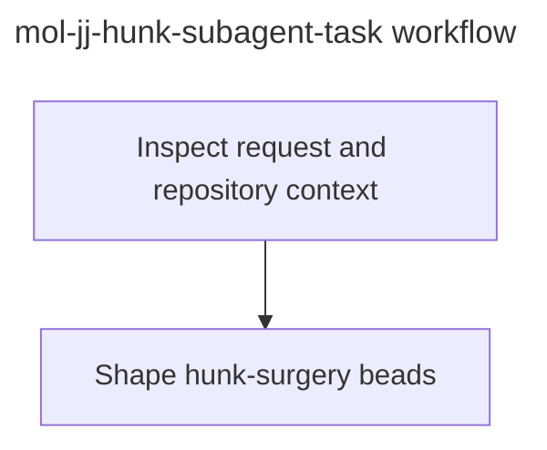

```mermaid
---
title: mol-jj-hunk-subagent-task workflow
---
flowchart TD
    inspect-request["Inspect request and repository context"]
    shape-beads["Shape hunk-surgery beads"]
    inspect-request --> shape-beads
```
