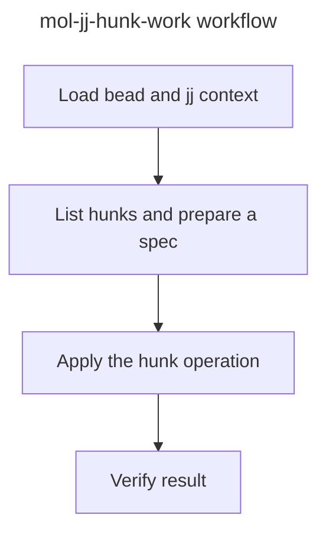

```mermaid
---
title: mol-jj-hunk-work workflow
---
flowchart TD
    load-context["Load bead and jj context"]
    list-hunks["List hunks and prepare a spec"]
    apply-operation["Apply the hunk operation"]
    verify["Verify result"]
    load-context --> list-hunks
    list-hunks --> apply-operation
    apply-operation --> verify
```
