# Bookmark Lifecycle

This diagram shows how the `gc/<pack>` bookmark is created, follows the live
workspace working copy, and how pack work eventually lands on the `main`
bookmark.

## Workspace references vs. bookmarks

- `default@` — working copy of the rig-root **default workspace**. New pack
  workspaces are created from this commit. It is not a bookmark.
- `main` — the **integration bookmark** for `gascity-packs`. Landed pack work
  ends up here.
- `gc/<pack>` — tracks the live `@` of a pack workspace.

## Lifecycle

```mermaid
flowchart TD
  subgraph creation["Workspace creation"]
    bead["Pack bead with gc.pack metadata"]
    prestart["pre_start runs pack-workspace-setup.sh"]
    base["Resolve base revset:<br/>default@, else main@origin, else @"]
    pattern["Set bookmark pattern:<br/>gc/&lt;pack&gt;.{name}"]
    jjw["jjw create --revision $REVSET --bookmark $BOOKMARK"]
    pin["jj bookmark set -B $BOOKMARK -r @"]

    bead --> prestart --> base --> pattern --> jjw --> pin
  end

  subgraph work["Pack work"]
    claim["Agent claims routed bead"]
    describe["jj describe -m '&lt;pack&gt;: &lt;task&gt;'"]
    edit["Edit pack files"]
    verify["gc lint &lt;pack&gt; + tests"]

    pin --> claim --> describe --> edit --> verify
  end

  subgraph land["Landing with mol-packer-complete"]
    review["Review main@..@"]
    clean["Clean commits:<br/>squash, split, abandon, describe"]
    rebase["jj rebase -s &lt;first-change&gt; -d main@"]
    move_main["jj bookmark move main --to &lt;tip&gt;"]
    verify_land["gc lint &lt;pack&gt; + tests"]
    reset["jj new main@"]

    verify --> review --> clean --> rebase --> move_main --> verify_land --> reset
  end

  subgraph next["Next bead"]
    next_claim["Agent claims next bead"]
    next_describe["jj describe -m '&lt;pack&gt;: &lt;next task&gt;'"]
    gc_bookmark["gc/&lt;pack&gt; bookmark advances with @"]

    reset --> next_claim --> next_describe --> gc_bookmark
  end
```

## Key rules

- The `gc/<pack>` bookmark tracks the workspace's `@`, not the landed state.
- `default@` is the default workspace working copy and the starting point for
  new workspaces; do not treat it as a bookmark.
- Do not move `gc/<pack>` or `main` during normal pack work.
- `mol-packer-complete` is the only place that advances `main` to the landed tip.
- After landing, `jj new main@` leaves a clean working copy; the `gc/<pack>`
  bookmark then advances again as soon as the agent describes the next change.
