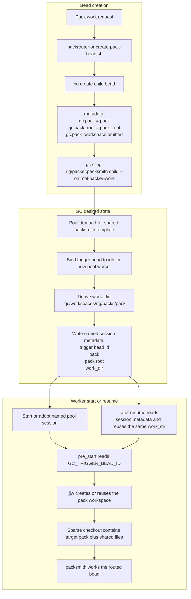

# Pack Workspace Reuse

```mermaid
flowchart TD
  subgraph creation["Bead creation"]
    request["Pack work request"]
    router["packrouter or create-pack-bead.sh"]
    child["bd create child bead"]
    metadata["metadata:<br/>gc.pack = pack<br/>gc.pack_root = pack_root<br/>gc.pack_workspace omitted"]
    sling["gc sling rig/packer.packsmith child --on mol-packer-work"]

    request --> router --> child --> metadata --> sling
  end

  subgraph desired["GC desired state"]
    demand["Pool demand for shared packsmith template"]
    bind["Bind trigger bead to idle or new pool worker"]
    workdir["Derive work_dir:<br/>.gc/workspaces/rig/packs/pack"]
    session["Write named session metadata:<br/>trigger bead id<br/>pack<br/>pack root<br/>work_dir"]

    sling --> demand --> bind --> workdir --> session
  end

  subgraph start["Worker start or resume"]
    start_session["Start or adopt named pool session"]
    prestart["pre_start reads GC_TRIGGER_BEAD_ID"]
    jjw["jjw creates or reuses the pack workspace"]
    sparse["Sparse checkout contains target pack plus shared files"]
    agent["packsmith works the routed bead"]
    resume["Later resume reads session metadata and reuses the same work_dir"]

    session --> start_session --> prestart --> jjw --> sparse --> agent
    session --> resume --> prestart
  end
```
