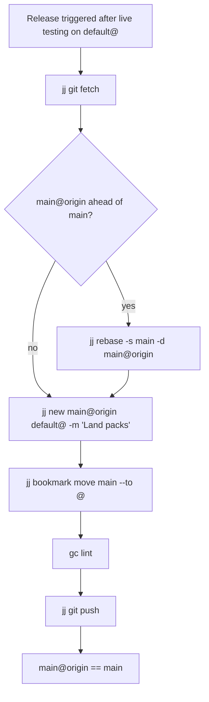

# Release Workflow

This diagram shows how tested pack work moves from `default@` to GitHub.

## Release steps

## Notes

- Release only after the pack has been tested on `default@` in a running Gas
  City.
- Always fetch first. `main@origin` is the live target.
- If origin has moved, rebase local `main` onto `main@origin` before landing.
- The release commit merges the tested `default@` state onto `main@origin`.
- After moving `main`, verify the landed packs still lint cleanly.
- Push only after verification.
- Do not push `gc/*` workspace bookmarks to origin; they are local-only.
