# Packer Workflow Overview

Packer uses three workflows that must not be confused: **packsmith work**,
**local integration testing**, and **release to GitHub**.

## Workspace and bookmark semantics

| Symbol | Meaning |
| --- | --- |
| `default@` | Working copy of the rig-root default workspace. New pack workspaces are created from this commit. Pack work is integrated here for testing in a running Gas City. |
| `main` | Local bookmark that tracks the published integration state. |
| `main@origin` | `main` bookmark on the `origin` remote. This is the live published state. |
| `gc/<pack>` | Live workspace bookmark for a pack workspace. Tracks `@`, not landed state. |

Note: `default@` is a workspace reference. A `default` bookmark, if it exists,
is unrelated and should be ignored.

## The three workflows

```mermaid
flowchart LR
  subgraph packsmith["1. Packsmith work"]
    claim["claim bead"]
    edit["edit pack files"]
    change["run mol-jj-change per logical change"]
    complete["run mol-packer-complete"]
    move_default["move default@ to integrated tip"]

    claim --> edit --> change --> complete --> move_default
  end

  subgraph test["2. Local integration test"]
    default["default@ workspace"]
    run_gc["run Gas City"]
    use_pack["agents use the pack"]

    move_default --> default --> run_gc --> use_pack
  end

  subgraph release["3. Release to GitHub"]
    fetch["jj git fetch"]
    merge["merge default@ onto main@origin"]
    move_main["move main to release commit"]
    verify["gc lint <pack>"]
    push["jj git push"]

    use_pack --> fetch --> merge --> move_main --> verify --> push
  end
```



## 1. Packsmith work

Packsmiths work in sparse jj workspaces scoped to one pack. Their integration
target is the rig-root default workspace working copy (`default@`).

- Each logical change goes through `mol-jj-change`.
- When the bead is complete, `mol-packer-complete` integrates the pack line
  onto `default@` by moving the default workspace to the integrated tip.
- Packsmiths do not push to `origin` and do not release to `main`.

Rebase onto `default@` only when the bead or formula says so, when `default@`
has moved forward, or when about to run `mol-packer-complete`. Do not rebase
after every trivial change.

## 2. Local integration test

After packsmiths integrate work onto `default@`, run Gas City from the rig-root
default workspace and have agents use the pack. This proves the pack works in a
live system.

`default@` is the local integration and testing head, not the release target.

## 3. Release to GitHub

Only after live testing does the release workflow push to `origin`. Before
pushing, ensure local `main` is on top of `main@origin`:

```bash
jj git fetch
jj log -r 'main | main@origin | default@' --no-graph

# If origin has moved ahead, rebase local main onto it
jj rebase -s main -d main@origin

# Merge the tested default@ state onto main@origin
jj new main@origin default@ -m "Land <pack> pack"
jj bookmark move main --to @

# Verify and push
gc lint <pack>
jj git push
```

For multiple packs, use `mol-packer-land` to merge the tested `default@` state
onto `main@origin` and push.

## Key rule

Pack work must be tested on `default@` in a running Gas City before it can be
released to `main`. Never confuse local integration testing (`default@`) with
the live published state (`main@origin`).
